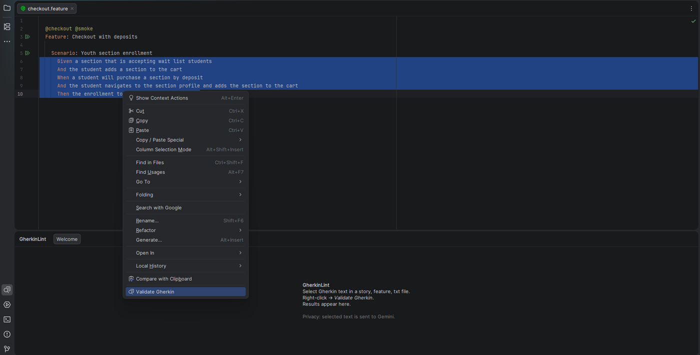
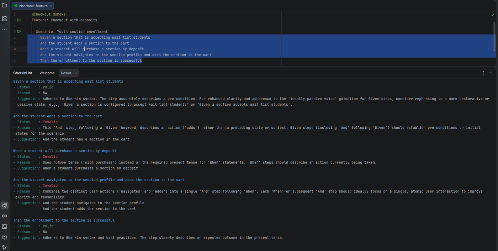
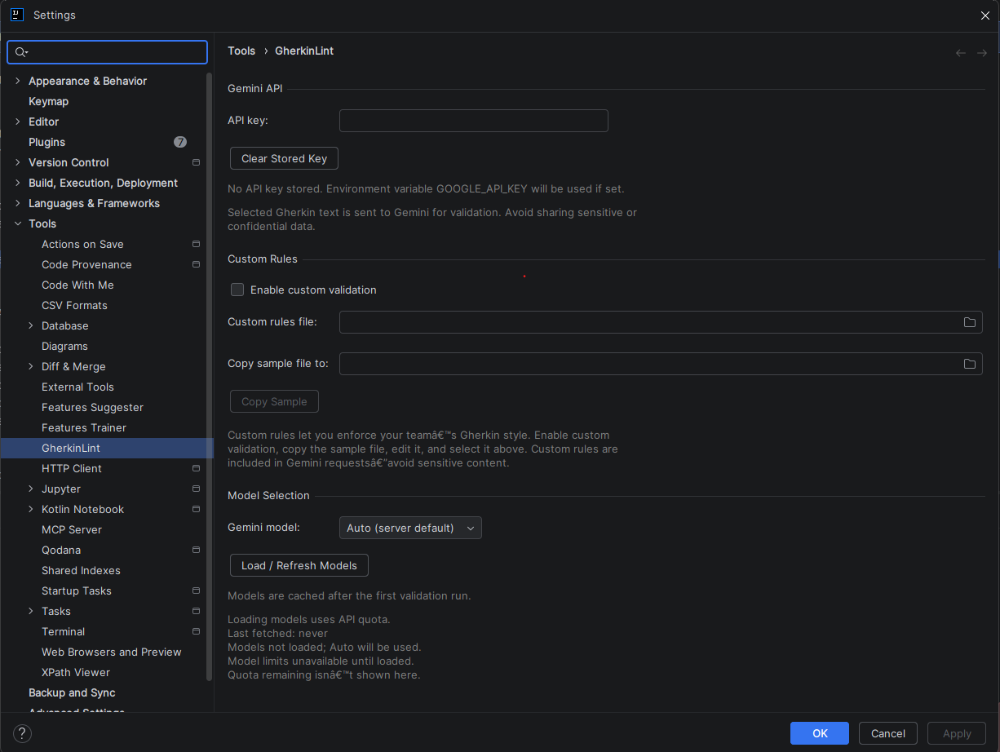

<!-- Plugin description -->
# GherkinLint

Write consistent, review-ready BDD Gherkin with a single click. GherkinLint validates selected text against clear, team-aligned rules and returns targeted suggestions so scenarios stay uniform across authors.

## Screenshots

## Key Features
- Validate selected Gherkin (Scenario/Given/When/Then/And/But) inside the editor
- Consistent style checks with actionable corrections
- Optional custom rules file for team-specific guidance
- Gemini model selection with cached model list to reduce API calls
- Results shown in a dedicated tool window

## Requirements
- A Gemini API key
- IntelliJ-based IDE (2025.3+ recommended)

## Quick Start
1. Open **Settings | Tools | GherkinLint** and add your Gemini API key.
2. (Optional) Load models and choose a preferred model.
3. Select Gherkin text in a feature/story file.
4. Run **Validate Gherkin** from the editor action menu.

## API Key Handling
- Stored securely in the IDE Password Safe.
- If not set, the plugin can read `GOOGLE_API_KEY` from your environment.
- You can clear the stored key at any time from settings.

## Model Usage and Cost
- Listing models and validation calls consume Gemini API quota.
- The model list is cached; use **Load / Refresh Models** only when needed.

## Custom Rules
Enable **Custom rules** and provide a JSON file to apply your team’s validation standards. If enabled without a file, the plugin will warn and fall back to default rules.

## Privacy
Do not submit sensitive data. Validation sends your selected text to the Gemini API.

## Development
See `docs/DEVELOPER_GUIDE.md` for setup, run, test, formatting, verifier, and publish steps.

## Contributing
See `CONTRIBUTING.md` for workflow and expectations.

## License
Licensed under the MIT License. See `LICENSE`.

## Support
Open an issue in this repository for bugs or feature requests.
<!-- Plugin description end -->
